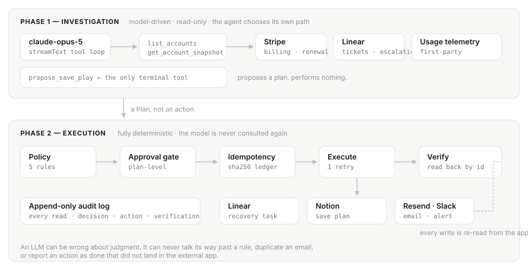

<div align="center">

# Backstop

**An autonomous revenue-retention agent that is trusted to take irreversible business actions — because every one of them is policy-checked, idempotent, approved, and verified by reading the app back.**

Built for the [Multi-App AI Agent Hackathon](https://multiappagenthackathon.com) · Lemma AI × Comma Capital

[Demo video (2 min)](DEMO_VIDEO_URL) · [Reliability report](evals/REPORT.md) · [Architecture](#architecture)

</div>

---

## The problem

Churn is rarely a surprise. It is a failed payment nobody chased, two support tickets that went
quiet, and a usage graph that bent downward six weeks before the renewal date — each signal
sitting in a different tool, none of them adding up in anybody's head until the cancellation
email arrives.

The work of catching it is unglamorous and entirely mechanical: read the billing system, read
the support queue, read the usage data, decide whether this account is actually in trouble, then
open the task, write the plan, send the email, book the follow-up, and tell the account owner.
It is roughly forty minutes of cross-app grind per account, which is exactly why it does not
happen until the quarter is already lost.

**Backstop does that work.** Not a dashboard that tells you an account is at risk — an agent that
investigates the account across five apps and then actually runs the recovery play.

## Why this is hard, and what most agents get wrong

Anyone can wire an LLM to the Slack API. The reason agents like this do not run in production is
that the moment an agent can send email to customers, create tickets, and write documents, the
interesting question stops being "can it do the work" and becomes:

- What stops it emailing an account that legal has flagged **do-not-contact**?
- What stops it emailing a customer who is mid-escalation, where a cheerful check-in makes things worse?
- What stops a retry, a page refresh, or a re-run from sending the same customer a second email?
- When it says it created the task — did it? Or did the API return 500 and the model narrate success?

Backstop's answer is an architecture, not a prompt.

## Architecture

> The model proposes. The runtime disposes.



**Phase 1 is genuinely agentic.** The model is handed read-only tools and left alone. It decides
which accounts to open, how deep to dig, when it has enough evidence, and what the play should be.
Trajectories differ by account: a failed payment sends it down the billing path, an open
escalation makes it stop and route to a human instead. Same code, different behaviour — that is
the difference between an agent and a script with an LLM bolted on.

**Phase 2 never asks the model anything.** Policy, approval, idempotency, execution, verification
and the ledger are all deterministic code in [`lib/execute.ts`](lib/execute.ts) and
[`lib/policy.ts`](lib/policy.ts). An LLM can be wrong about judgment; it can never talk its way
past a rule, duplicate an email, or report an action as done that did not land.

The system prompt says this to the model explicitly:

> *A deterministic policy engine runs after you, on the plan you produce. Propose what the evidence
> actually warrants. Do not omit a needed action because you suspect it might be blocked — that is
> the runtime's decision, not yours, and silently self-censoring hides real risk from the operator.*

This is deliberate. Safety that depends on the model behaving is not safety. In the demo you can
watch the agent propose a perfectly sensible outreach to Northwind Trading and watch the policy
engine refuse it — defence in depth you can see working.

### The four reliability primitives

| Primitive | File | What it guarantees |
|---|---|---|
| **Policy engine** | [`lib/policy.ts`](lib/policy.ts) | Five deterministic, pure-function rules decide `allow` / `block` / `require_approval` per action type, with a reason and its evidence. |
| **Idempotency ledger** | [`lib/idempotency.ts`](lib/idempotency.ts) | `sha256(accountId + actionType + planId)` is looked up before every write. Replaying a plan performs **zero** new actions and reports the original resource. |
| **Read-back verification** | [`lib/verify` in each connector](lib/connectors) | After every write the resource is re-fetched **from that app's own API** by id. An action is only "done" when the external system confirms it. |
| **Audit log** | [`lib/audit.ts`](lib/audit.ts) | Append-only JSONL of every read, decision, policy evaluation, action and verification. The UI timeline renders from it; the eval suite asserts against it. |

### The policy rules

| Rule | Trigger | Effect |
|---|---|---|
| `DO_NOT_CONTACT` | account tagged `do-not-contact` | **Blocks every action**, internal ones included. Hard stop. |
| `OPEN_ESCALATION` | an open Linear issue labelled `escalation` | Blocks customer-facing outreach; internal alert still allowed so a human picks it up. |
| `CONTACT_FREQUENCY` | last outbound touch inside 7 days | Suppresses further outreach. |
| `ENTERPRISE_APPROVAL` | MRR > $5,000/mo | **Every** action requires human approval. Never automatic. |
| `CUSTOMER_CONTACT_APPROVAL` | plan contains customer-visible outreach | A human signs off before anything the customer sees. Default posture, any account size. |

Approval is **plan-level on purpose**: a save play is approved or it is not. Backstop never
half-executes a recovery sequence.

### Replay vs. re-investigate — a distinction worth being precise about

Idempotency here means **replay safety**, not "never act on this account twice". The two are
different and Backstop treats them differently:

- **Replaying a plan** — same plan id, so the same action keys — performs **zero** writes. A
  retry, a double-click, a page refresh, or a crashed process resuming cannot produce a second
  email. The console has a *Replay this exact plan* button so you can see this rather than take
  it on trust; the eval suite asserts it.
- **Running a fresh investigation** mints a new plan and *is* allowed to act, because the
  account's state may genuinely have moved on. What stops that becoming spam is not the
  idempotency ledger but the `CONTACT_FREQUENCY` policy rule, which suppresses outreach inside a
  seven-day cooldown.

Conflating the two would give a comfortable demo and the wrong system.

## External apps

Five connectors are implemented. **The recorded demo runs with three of them credentialed —
Stripe, Linear and Resend** — which is what the two-minute video shows end to end. Notion and
Slack are fully implemented and need only their environment variables; Backstop detects which
connectors are configured and drops unavailable actions from the plan rather than failing on
them, so the agent's behaviour degrades cleanly.

Every write is verified by a read-back against the app's own API.

| App | Direction | What Backstop does with it | Verified by | Status |
|---|---|---|---|---|
| **Stripe** (test mode) | read | MRR, subscription status, renewal date, uncollected invoices | — | ✅ in demo |
| **Linear** | read + write | Reads open tickets and escalations; creates the recovery task | `linear.issue(id)` re-fetch + title match | ✅ in demo |
| **Notion** | write | Writes the evidence-backed save-plan document | `pages.retrieve(id)`, asserts not archived | implemented |
| **Resend** | write | Sends the tailored customer email | `emails.get(id)`, asserts delivery status | ✅ in demo |
| **Slack** | write | Block Kit alert to the account owner with the evidence | `chat.getPermalink(ts)` re-resolve | implemented |

Product-usage telemetry (weekly active seats) is Backstop's own first-party data in
[`data/accounts.json`](data/accounts.json) — as it would be for any real vendor. Billing and
support signals are **not** read from there: they are fetched live from Stripe and Linear on every
run. `pnpm seed` writes the demo tenancy *into* those apps; the agent then reads it *back out* over
the real APIs.

## Setup

Requires Node 20+ and pnpm. Total setup is about ten minutes, most of it creating free accounts.

```bash
git clone https://github.com/ShaanGS/backstop.git
cd backstop
pnpm install
cp .env.example .env.local
```

Fill in `.env.local`:

| Variable | Where to get it | Time |
|---|---|---|
| `ANTHROPIC_API_KEY` | [console.anthropic.com](https://console.anthropic.com) | 1 min |
| `STRIPE_SECRET_KEY` | Stripe dashboard → Developers → API keys → **test mode** | 1 min |
| `LINEAR_API_KEY` | Linear → Settings → Security & access → Personal API keys | 1 min |
| `NOTION_API_KEY` + `NOTION_PARENT_PAGE_ID` | [notion.so/my-integrations](https://www.notion.so/my-integrations), then **share a page with the integration**. The page id is the 32-char hex in its URL. | 3 min |
| `RESEND_API_KEY` | [resend.com](https://resend.com) → API keys | 1 min |
| `SLACK_BOT_TOKEN` + `SLACK_CHANNEL_ID` | [api.slack.com/apps](https://api.slack.com/apps) → create app → OAuth & Permissions → add **`chat:write`** bot scope → install to workspace → copy `xoxb-…`. Then `/invite @Backstop` in the channel and copy its id from the channel's URL. | 5 min |

> **`RESEND_TO_OVERRIDE` is a safety valve, not a workaround.** With it set, every customer email is
> redirected to that address, the intended recipient is preserved in the subject and an
> `X-Backstop-Intended-Recipient` header, and the email body says so. Without a verified sending
> domain Resend only delivers to your own address anyway — but this is the posture we would ship
> with in any non-production environment regardless, and it is why the demo can run against
> realistic accounts with zero chance of mailing a real person.

Then seed the external apps and run:

```bash
pnpm seed   # creates real Stripe customers, subscriptions, a genuinely declined
            # invoice, and labelled Linear tickets. Safe to re-run — everything
            # is looked up before it is created.
pnpm dev    # http://localhost:3100
```

`pnpm seed` refuses to run against a live Stripe key.

Useful flags:

```bash
BACKSTOP_DRY_RUN=1 pnpm dev   # trace the whole pipeline, perform no external writes
BACKSTOP_MODEL=claude-sonnet-5 pnpm dev
```

## How I tested and verified it works

Three layers, in increasing order of how much they prove.

### 1. The reliability suite — 14 cases, `pnpm eval`

The suite drives the **real** `evaluatePolicy` and `executePlan` — the same functions the product
runs — against pinned account states, and asserts on what actually happened. Every case checks six
things:

1. The expected policy rules fired for that account state.
2. The approval gate engaged (or did not) exactly as specified.
3. A gated plan that is never approved performs **zero** actions.
4. Exactly the expected actions executed, and exactly the expected actions were blocked.
5. Every executed action carries a **passing post-action verification**.
6. Replaying a completed plan performs **zero** new actions and reports them as skipped.

**Nine must-act cases** cover the happy paths — full save play, usage-decline-only, internal-only
plans that need no human, imminent renewal on a healthy account, documentation-only plays.

**Five must-not-act cases** are the ones that matter, and they are the reason I trust this thing:

| Case | Asserts |
|---|---|
| `do-not-contact` | A tagged account gets **zero** actions — internal ones blocked too |
| `escalation-blocks-email` | Customer email blocked, internal Slack alert still delivered |
| `enterprise-halts` | A $6,800/mo account halts at the approval gate; unapproved ⇒ nothing runs |
| `contact-cooldown` | Contacted 2 days ago ⇒ outreach suppressed, internal task still allowed |
| `idempotent-rerun` | Replaying a completed plan ⇒ 0 executed, 3 skipped |

```
  14/14 cases passed · 5/5 must-not-act cases passed
```

Full generated scorecard: **[`evals/REPORT.md`](evals/REPORT.md)**.

**Two modes, and the difference is stated plainly rather than hidden:**

```bash
pnpm eval          # fixture mode — BACKSTOP_SINK=1 stubs ONLY the third-party
                   # network boundary. Every Backstop gate (policy, idempotency,
                   # retry, verification wiring, ledger) still runs for real.
                   # Deterministic, fast, needs no API keys, CI-able.

pnpm eval --live   # identical cases with the stub removed — real writes to the
                   # real Stripe / Linear / Slack / Notion / Resend workspaces.
```

Fixture mode proves the decision logic; live mode proves the integrations. Both are run before
submission.

### 2. End-to-end verification against the real apps

A real run, captured from the live system:

```
→ list_accounts                    6 accounts
→ get_account_snapshot  ×6         all six investigated in parallel
→ propose_save_play                Acme Robotics, risk 92/100

POLICY  CUSTOMER_CONTACT_APPROVAL → require_approval
⏸ halted at the approval gate

[approved]
EXECUTED  create_linear_issue   verified=true  Issue MAR-11 exists with matching title.
EXECUTED  send_customer_email   verified=true  Message 02805b7b… present in Resend, status sent.
executed=2 failed=0
```

The agent chose Acme on its own and, unprompted, flagged a conflict in the evidence: Stripe
reported the subscription `active` while $4,500 sat uncollected, so it told the owner to
establish whether this was a dunning failure or a customer withholding payment on a product
they could not log into — *before* any collections action. That judgment is not in the
system prompt.


After a live run I confirm each write by hand in the app itself — the Linear issue, the Notion
page, the email in the inbox, the Slack message — and check it against what the UI claims. The
UI's green tick is not cosmetic: it only appears when the connector's own `verify*` function
re-fetched that resource by id and the external system confirmed it.

Then the adversarial checks:

- **Replay the identical plan** → `executed=0, skipped=2`, and no duplicate anything in any app:

  ```
  --- approve ---
    executed=2 skipped=0 failed=0
  --- REPLAY same plan ---
     SKIPPED_IDEMPOTENT · create_linear_issue
     SKIPPED_IDEMPOTENT · send_customer_email
    executed=0 skipped=2 failed=0
  ```
- **Run against the `do-not-contact` account** → `0 executed, 4 blocked`, reason recorded in the timeline.
- **Kill a connector mid-run** (revoke the Linear key) → the action retries once, fails honestly,
  and is reported as `failed` rather than silently swallowed.
- **`cat .backstop/audit.jsonl`** → every read, decision, policy evaluation, action and
  verification is present, in order, with timestamps.

### 3. Types and lint

`pnpm typecheck` is clean — no `any` in the domain layer, and every connector return type is
modelled in [`lib/types.ts`](lib/types.ts).

## Using it

Open `http://localhost:3100`.

- The left rail shows connector health and the book of business, sorted by a deterministic risk
  score with usage sparklines.
- **"Find the account most at risk and run the save play"** starts an open-ended run — the agent
  picks the account itself.
- Clicking any account investigates that one specifically.
- Watch the run stream: tool calls as they fire, the agent's reasoning, the evidence it gathered
  (each item linking back to the record in the source app), its proposed plan, then the policy
  verdicts.
- If the plan needs a human, it stops at the approval gate. Approve, and the timeline executes —
  each row expanding to show the external id, the idempotency key, and the verification receipt.
- Hit **Re-run** to watch every action come back as skipped.

## Project layout

```
lib/
  agent/          system prompt, tools, the streaming investigation loop
  connectors/     one module per external app — read, write, and verify
  policy.ts       the five deterministic rules
  execute.ts      the five-gate execution pipeline
  idempotency.ts  the action ledger
  audit.ts        append-only event log
  store.ts        account registry, usage telemetry, snapshot assembly
evals/            14 cases + the runner that drives the real pipeline
scripts/seed.ts   writes the demo tenancy into Stripe and Linear
app/              Next.js 16 console — streaming NDJSON, no polling
```

## Stack

Next.js 16 · React 19 · TypeScript · Vercel AI SDK v6 (`streamText` + tool loop) ·
`claude-opus-5` · Tailwind v4 with a hand-built token layer · official SDKs for all five apps.
No database — state is durable JSON under `.backstop/`, which keeps the clone-to-running path
at two commands.

## Honest limitations

- The account registry and usage telemetry are seeded fixtures. In production these are your own
  database and your own product analytics; the agent's interface to them would not change.
- Quiet-hours deferral is specified in the policy design but not implemented — the four other
  rules are, and are tested.
- Approval lives in Backstop's own UI rather than Slack interactivity, which avoids needing a
  public webhook. Slack is notify-only.
- Single-tenant, single-workspace. There is no auth on the console.

## License

MIT
